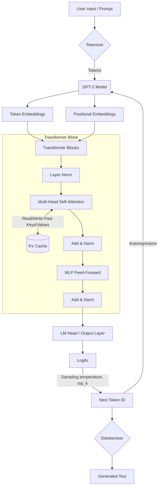
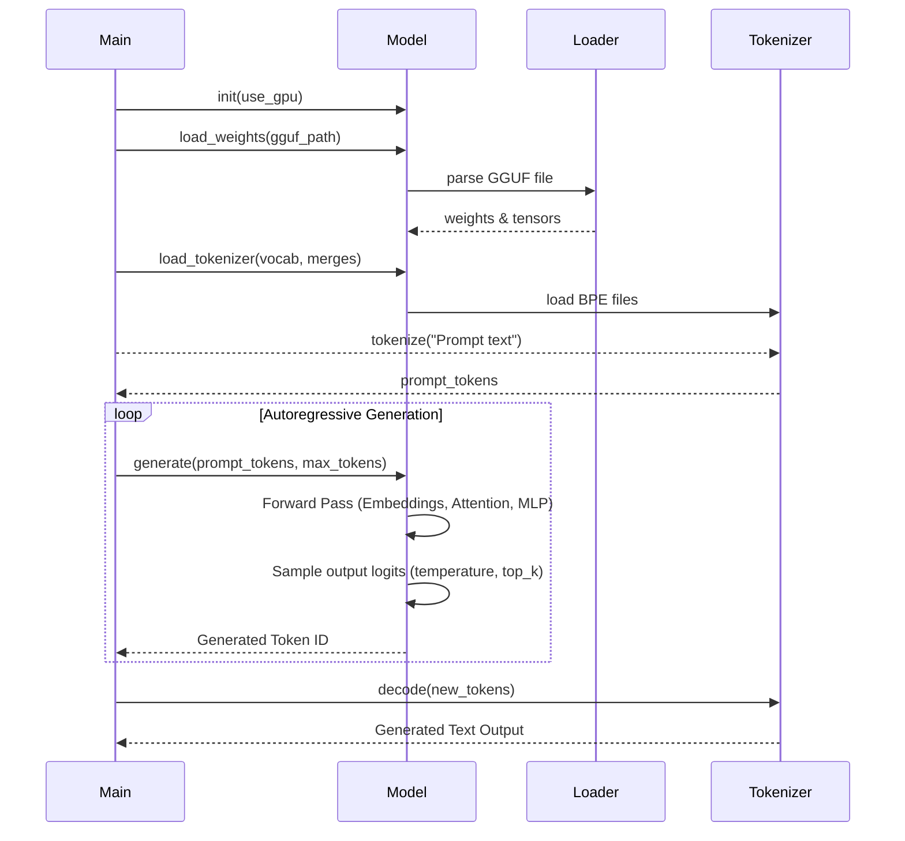

# GPT-2 Inference Engine

A C++ inference engine for GPT-2 model using `ggml`. This engine can load GPT-2 model in GGUF format and perform text generation.

## 🏗️ Architecture

The inference pipeline follows a standard autoregressive generation loop.



### Execution Flow



## 🚀 How to Run

### Prerequisites
- **CMake** (3.16+)
- **CUDA Toolkit** (for GPU acceleration, target sm_75/T4 by default)
- **ggml** library (C/C++ tensor library)

### Building

1. **Clone and build the `ggml` library** (must be parallel to this repository by default, or provide path via `-DGGML_DIR`):
   ```bash
   git clone https://github.com/ggerganov/ggml.git ../ggml
   cd ../ggml
   mkdir build && cd build
   cmake .. 
   make -j
   cd ../../inference-engine
   ```

2. **Build the Engine**:
   ```bash
   mkdir build && cd build
   cmake ..
   make -j
   ```

### Running Inference

Run the generated executable located in the `bin/` directory:

```bash
./build/bin/gpt2 <prompt> [max_tokens] [temperature] [top_k]
```

**Example:**
```bash
./build/bin/gpt2 "Once upon a time" 50 0.8 50
```

*Note: The current implementation looks for the model, vocabulary, and merges at specific hardcoded paths (e.g. `/content/gpt2-model/`). Make sure these files are present or adjust `src/main.cpp` accordingly.*
